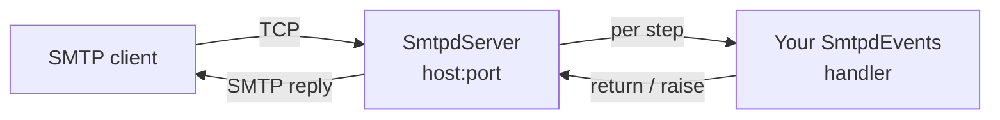
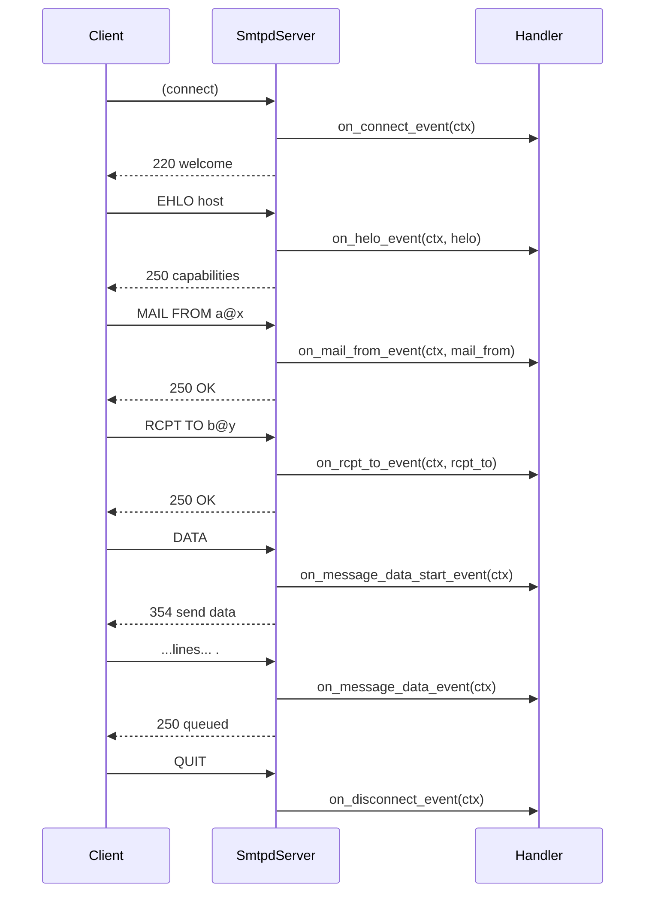

# The ```smtpd``` core library

```tokeo.core.smtpd``` is a standalone, ```asyncio```-based SMTP **receiving**
server. You write a small handler class; the server runs the SMTP conversation,
calls your handler at each step, and turns your decisions into the correct SMTP
responses.

Note: Tokeo smtpd is based on MidiSmtpServer -- a faithful, one-to-one port of
the Ruby gem
[midi-smtp-server](https://github.com/4commerce-technologies-AG/midi-smtp-server):
the events, the context object, the configuration options, the exceptions and the
lifecycle all mirror the original, so existing handlers port over directly. You do
not need to know the original to use the library.

.. note::

    Receiving only. This is the daemon that *accepts* incoming mail. To *send*
    mail, use a client library instead.

.. note::

    This page documents the **library** (```tokeo.core.smtpd```): you construct
    and drive ```SmtpdServer``` yourself. Running it as a managed Cement service
    (config blocks, CLI, pre-forking) is the job of the ```tokeo.ext.smtpd```
    extension and is documented there.

## 1. What you build

Two things:

1. **A handler class** — a subclass of ```SmtpdEvents``` with the event methods
   you care about. Every event has a safe default, so you override only what you
   need.
2. **A server** — an ```SmtpdServer``` bound to your handler, told which ports and
   hosts to listen on, then served.

## 2. Quick start

```python
import asyncio
from tokeo.core.smtpd import SmtpdServer, SmtpdEvents, Smtpd550Exception


class MailHandler(SmtpdEvents):

    def on_rcpt_to_event(self, ctx, rcpt_to):
        # only accept mail addressed to our domain, reject the rest
        if not rcpt_to.strip('<>').endswith('@example.com'):
            raise Smtpd550Exception             # client sees "550 ..."

    def on_message_data_event(self, ctx):
        # the complete message has arrived; do something with it
        print('from:', ctx.envelope.mail_from)
        print('to:  ', ctx.envelope.rcpt_tos)
        print(bytes(ctx.message.data).decode('utf-8', 'replace'))


async def main():
    server = SmtpdServer(MailHandler(), ports=2525, hosts='127.0.0.1')
    await server.start()          # bind and serve in the background
    try:
        await server.join()       # run until stopped
    finally:
        await server.stop()


asyncio.run(main())
```

Point any mail client at ```127.0.0.1:2525``` and send a message.

## 3. How it fits together

The server accepts a TCP connection and drives the SMTP conversation on it. At
each meaningful step it calls **your** handler; your return value or raised
exception becomes the SMTP response.



One connection walks through the SMTP command sequence. The server enforces the
ordering (```HELO``` before ```MAIL```, ```MAIL``` before ```RCPT```, and so on)
and calls your handler at each stage:



## 4. Events

Your handler subclasses ```SmtpdEvents``` and overrides the events it needs.
Every event has a safe default (accept and continue), so a handler can be as small
as a single method. The full set, in the order they can occur:

<table border="1" cellpadding="6" cellspacing="0">
<thead>
<tr><th>Event</th><th>Called</th><th>Argument(s) beyond ctx</th></tr>
</thead>
<tbody>
<tr><td>on_connect_event</td><td>new connection accepted</td><td>—</td></tr>
<tr><td>on_proxy_event</td><td>after a valid PROXY line</td><td>proxy_data</td></tr>
<tr><td>on_helo_event</td><td>on HELO/EHLO</td><td>helo_data</td></tr>
<tr><td>on_auth_event</td><td>on AUTH (see below)</td><td>authorization_id, authentication_id, authentication</td></tr>
<tr><td>on_mail_from_event</td><td>on MAIL FROM</td><td>mail_from_data</td></tr>
<tr><td>on_rcpt_to_event</td><td>on RCPT TO</td><td>rcpt_to_data</td></tr>
<tr><td>on_message_data_start_event</td><td>DATA accepted, before body</td><td>—</td></tr>
<tr><td>on_message_data_receiving_event</td><td>repeatedly, while the body arrives</td><td>—</td></tr>
<tr><td>on_message_data_headers_event</td><td>when the header/body boundary is reached</td><td>—</td></tr>
<tr><td>on_message_data_event</td><td>the complete message has arrived</td><td>—</td></tr>
<tr><td>on_process_line_unknown_event</td><td>an unrecognized command line</td><td>line</td></tr>
<tr><td>on_disconnect_event</td><td>connection closing</td><td>—</td></tr>
<tr><td>on_logging_event</td><td>a log message is emitted</td><td>severity, msg, err=None</td></tr>
</tbody>
</table>

Two conventions matter:

- **Return value.** Where an event returns a value (for example
  ```on_mail_from_event```), returning a string replaces the address the server
  stores; returning ```None``` keeps the parsed value. Most handlers return
  nothing.
- **Raising decides the reply.** Raise one of the ```Smtpd*Exception``` classes
  (section 7) to reject a step; the exception carries the SMTP status line the
  client receives.

.. note::

    ```on_message_data_receiving_event``` runs once per received line and is on
    the hot path. Keep it fast and do not decorate it with ```@threaded```; the
    library rejects that at import time.

### Slow work: ```@threaded```

If an event does something slow (a database call, a network request), decorate it
with ```threaded``` so it runs in a worker thread instead of blocking the event
loop:

```python
from tokeo.core.smtpd import SmtpdEvents, threaded


class MailHandler(SmtpdEvents):

    @threaded
    def on_message_data_event(self, ctx):
        store_in_database(bytes(ctx.message.data))   # slow, offloaded
```

```@threaded``` may only be applied to regular (```def```) events, never to
per-line events and never to ```async def``` events (a coroutine can already
```await```).

### Helpers

Inside a handler, two helpers report connection state:
```self.authenticated(ctx)``` is true once the client has authenticated, and
```self.encrypted(ctx)``` is true once the connection is running over TLS.

## 5. The context object

Every event receives the same per-connection ```ctx``` (an ```SmtpdContext```),
which carries the whole state of the conversation. It has three parts:

**```ctx.server```** — the connection and session:
```local_host```, ```local_ip```, ```local_port```, ```remote_host```,
```remote_ip```, ```remote_port```, ```helo```, ```proxy```, ```connected```,
```authorization_id```, ```authentication_id```, ```authenticated```,
```encrypted```, plus ```exceptions``` and ```errors``` accumulated during the
session.

**```ctx.envelope```** — the current transaction:
```mail_from``` (the sender), ```rcpt_tos``` (the list of recipients) and
```encoding_body```.

**```ctx.message```** — the message being received:
```data``` (a ```bytearray``` of the raw message), ```bytesize```,
```received```, ```delivered```, ```headers``` and ```crlf```.

A transaction (envelope + message) resets after each delivered message or a
```RSET```, while the server/session part persists for the life of the connection.

.. note::

    ```ctx.message.data``` is a ```bytearray```; wrap it in ```bytes(...)``` (and
    decode) when you need an immutable copy or text.

```SmtpdContextEncoder``` is provided to serialize a context to JSON (it drops the
raw ```data``` body), which is handy for logging or enqueuing a job.

## 6. Authentication

```AUTH PLAIN``` and ```AUTH LOGIN``` are supported. Set ```auth_mode``` to
```'AUTH_OPTIONAL'``` (offer it) or ```'AUTH_REQUIRED'``` (require it before
```MAIL```); the default is ```'AUTH_FORBIDDEN'``` (not offered).

You decide who may authenticate in ```on_auth_event```. Return an
```authorization_id``` (any truthy identifier) to grant access; raise
```Smtpd535Exception``` to deny:

```python
class MailHandler(SmtpdEvents):

    def on_auth_event(self, ctx, authorization_id, authentication_id, authentication):
        if authentication_id == 'admin' and authentication == 's3cret':
            return 'admin'                 # granted; stored as authorization_id
        raise Smtpd535Exception            # "535 authentication failed"
```

By default (no override) ```on_auth_event``` denies every attempt.

## 7. Responses and exceptions

Successful steps produce the standard ```2xx```/```3xx``` replies automatically.
To reject a step, raise the matching exception; each one carries its SMTP status
line. The available classes (all importable from ```tokeo.core.smtpd```):

<table border="1" cellpadding="6" cellspacing="0">
<thead>
<tr><th>Exception</th><th>Reply</th><th>Typical use</th></tr>
</thead>
<tbody>
<tr><td>Smtpd421Exception</td><td>421 service not available</td><td>refuse / abort the connection</td></tr>
<tr><td>Smtpd450Exception<br>Smtpd451Exception<br>Smtpd452Exception</td><td>4xx temporary</td><td>greylisting, transient failure</td></tr>
<tr><td>Smtpd500Exception<br>Smtpd501Exception<br>Smtpd502Exception</td><td>syntax / not implemented</td><td>bad or unsupported command</td></tr>
<tr><td>Smtpd503Exception</td><td>503 bad sequence</td><td>command out of order</td></tr>
<tr><td>Smtpd530Exception</td><td>530 authentication required</td><td>gate before MAIL</td></tr>
<tr><td>Smtpd535Exception</td><td>535 authentication failed</td><td>deny AUTH</td></tr>
<tr><td>Smtpd550Exception<br>Smtpd552Exception<br>Smtpd553Exception<br>Smtpd554Exception</td><td>5xx permanent</td><td>reject recipient / message</td></tr>
<tr><td>Tls454Exception<br>Tls530Exception</td><td>TLS-related</td><td>STARTTLS problems / TLS required</td></tr>
</tbody>
</table>

The full set is present (```Smtpd432```, ```Smtpd454```, ```Smtpd521```,
```Smtpd534```, ```Smtpd538```, and the pipelining/CRLF ```Smtpd500``` variants).
A handful of Python control exceptions (```SmtpdStopConnectionException```,
```SmtpdStopServiceException```, ```SmtpdIOTimeoutException```,
```SmtpdIOBufferOverrunException```) round out the internal signalling.

### Which replies are valid per command

Not every reply code is allowed after every command. The command/reply sequences
below are the SMTP standard (RFC 821 §4.3) and
are what the server produces for each state. Reply classes: **S** success,
**I** intermediate, **F** failure, **E** error.

<table border="1" cellpadding="6" cellspacing="0">
<thead>
<tr><th>Command / state</th><th>Success (S)</th><th>Failure (F)</th><th>Error (E)</th></tr>
</thead>
<tbody>
<tr><td>Connection established</td><td>220</td><td>421</td><td>—</td></tr>
<tr><td>HELO / EHLO</td><td>250</td><td>—</td><td>500, 501, 504, 421</td></tr>
<tr><td>MAIL FROM</td><td>250</td><td>552, 451, 452</td><td>500, 501, 421</td></tr>
<tr><td>RCPT TO</td><td>250, 251</td><td>550, 551, 552, 553, 450, 451, 452</td><td>500, 501, 503, 421</td></tr>
<tr><td>DATA (accept)</td><td>I: 354</td><td>451, 554</td><td>500, 501, 503, 421</td></tr>
<tr><td>DATA (after body)</td><td>250</td><td>552, 554, 451, 452</td><td>—</td></tr>
<tr><td>RSET</td><td>250</td><td>—</td><td>500, 501, 504, 421</td></tr>
<tr><td>NOOP</td><td>250</td><td>—</td><td>500, 421</td></tr>
<tr><td>QUIT</td><td>221</td><td>—</td><td>500</td></tr>
</tbody>
</table>

The **421** reply (service not available, closing the channel) may be returned for
any command when the server must shut down. Raising the matching ```Smtpd*Exception```
from a handler produces one of the failure/error codes above; returning normally
produces the success code.

## 8. TLS and STARTTLS

Set ```encrypt_mode``` to ```'TLS_OPTIONAL'``` (offer ```STARTTLS```),
```'TLS_WHEN_AUTH'``` (like ```TLS_OPTIONAL```, but ```AUTH``` is only offered and
accepted on an encrypted channel - this mode protects credentials against a plaintext downgrade) or ```'TLS_REQUIRED'``` (require encryption in any way); the default is ```'TLS_FORBIDDEN'```. When encryption is enabled the server upgrades the
connection in place on ```STARTTLS``` and discards any bytes buffered before the
handshake, so a command injected ahead of the handshake can never run over the
encrypted channel.

The certificate can be supplied three ways:

```python
# 1. from files on disk
SmtpdServer(handler, encrypt_mode='TLS_REQUIRED',
            tls_cert_path='/etc/ssl/mx.pem', tls_key_path='/etc/ssl/mx.key')

# 2. from PEM strings held in memory (never written to disk)
SmtpdServer(handler, encrypt_mode='TLS_REQUIRED',
            tls_cert=cert_pem_str, tls_key=key_pem_str)

# 3. nothing configured -> a self-signed test certificate is generated
SmtpdServer(handler, encrypt_mode='TLS_OPTIONAL',
            tls_cert_cn='mx.example.com', tls_cert_san=['mx.example.com', '127.0.0.1'])
```

The self-signed certificate is generated in-process with ```cryptography``` (RSA
4096, SHA256, 90 days, CN and subject alt names, serverAuth) — no subprocess and
no temp file is involved. The default ciphers and TLS floor follow the current
Mozilla "Intermediate" profile: the default minimum is TLS 1.2 (the RFC 8996
minimum for a secure server), ECDHE is preferred over DHE, and only AEAD suites
(AES-GCM, ChaCha20) are used. Three presets are available via ```tls_methods```
and ```tls_ciphers```: MODERN (```'TLSv1_3'```, TLS 1.3 only), ADVANCED (default,
TLS 1.2+), and LEGACY (```TLS_METHODS_LEGACY``` + ```TLS_CIPHERS_LEGACY```) — an
opt-in that lowers the floor to TLS 1.0 and adds forward-secret SHA1 CBC suites
(but no 3DES/RC4/DES/MD5) to still reach old clients, useful for opportunistic
SMTP TLS where a weakly-encrypted hop beats a cleartext one. TLS 1.3 key-exchange
groups are left at the runtime default, so a build on OpenSSL 3.5+ negotiates the
post-quantum hybrid (X25519MLKEM768) automatically. ```TlsTransport``` holds the
built ```ssl.SSLContext```.

.. note::

    The in-memory string certificate is loaded through a RAM-backed file
    descriptor (```tokeo.core.utils.memfd```), because the stdlib
    ```ssl.SSLContext``` only loads a server certificate from a filesystem path.
    The private key never touches disk.

## 9. The PROXY protocol

To sit behind a proxy or load balancer that speaks the PROXY protocol, set
```proxy_extension=True```. The server then accepts a leading ```PROXY``` line,
validates it (TCP4/TCP6, normalized addresses and ports), stores the parsed result
on ```ctx.server.proxy``` and calls ```on_proxy_event```. The original client
address is thus available to your handler.

## 10. Listeners, limits and options

The constructor keeps the original option names. Key ones:

<table border="1" cellpadding="6" cellspacing="0">
<thead>
<tr><th>Option</th><th>Default</th><th>Meaning</th></tr>
</thead>
<tbody>
<tr><td>ports</td><td>2525</td><td>port(s); '2525, 3535' or a '2525:3535' range</td></tr>
<tr><td>hosts</td><td>127.0.0.1</td><td>host(s); '127.0.0.1, ::1' or '*' for all interfaces</td></tr>
<tr><td>max_processings</td><td>4</td><td>connections processed simultaneously</td></tr>
<tr><td>max_connections</td><td>None</td><td>concurrent connections accepted (None = unlimited)</td></tr>
<tr><td>auth_mode</td><td>'AUTH_FORBIDDEN'</td><td>AUTH_OPTIONAL / AUTH_REQUIRED</td></tr>
<tr><td>encrypt_mode</td><td>'TLS_FORBIDDEN'</td><td>TLS_OPTIONAL / TLS_WHEN_AUTH / TLS_REQUIRED</td></tr>
<tr><td>proxy_extension</td><td>False</td><td>accept the PROXY protocol</td></tr>
<tr><td>pipelining_extension</td><td>False</td><td>advertise PIPELINING</td></tr>
<tr><td>internationalization_extensions</td><td>False</td><td>advertise 8BITMIME and SMTPUTF8</td></tr>
<tr><td>do_dns_reverse_lookup</td><td>True</td><td>resolve the remote host name</td></tr>
<tr><td>io_cmd_timeout</td><td>30</td><td>seconds to await a complete command line</td></tr>
<tr><td>io_buffer_max_size</td><td>1 MiB</td><td>maximum line length before rejection</td></tr>
</tbody>
</table>

```ports```/```hosts``` are parsed into ```server.ports```, ```server.hosts``` and
the resulting ```server.addresses```. If you call ```serve()```/```start()```
without arguments, the server binds to those addresses; you can also pass explicit
listeners:

```python
await server.start([{'host': '127.0.0.1', 'port': 2525},
                    {'host': '::1', 'port': 2526}])
```

### Sharing limits across services

```max_processings``` and ```max_connections``` are per-server. To cap several
servers against one shared budget (for example when running several listeners in
one process), pass a shared ```GlobalLimits``` to each:

```python
from tokeo.core.smtpd import GlobalLimits

limits = GlobalLimits(max_connections=200, max_processings=50)
server_a = SmtpdServer(handler, ports=2525, global_limits=limits)
server_b = SmtpdServer(handler, ports=2526, global_limits=limits)
```

## 11. Lifecycle

```SmtpdServer``` exposes an ```asyncio``` lifecycle:

<table border="1" cellpadding="6" cellspacing="0">
<thead>
<tr><th>Method</th><th>Purpose</th></tr>
</thead>
<tbody>
<tr><td>await serve(listeners=None)</td><td>bind and serve, blocking until stopped</td></tr>
<tr><td>await start(listeners=None)</td><td>bind and serve in the background, then return</td></tr>
<tr><td>await join()</td><td>wait until the server is stopped</td></tr>
<tr><td>await stop(wait_seconds_before_close=2.0, gracefully=True)</td><td>stop accepting, drain in-flight connections, then close</td></tr>
<tr><td>shutdown()</td><td>request a shutdown</td></tr>
<tr><td>shutdown_requested / stopped</td><td>current state flags</td></tr>
<tr><td>connections / processings</td><td>active connection / processing counts</td></tr>
<tr><td>has_connections() / has_processings()</td><td>whether any is currently active</td></tr>
</tbody>
</table>

A graceful ```stop``` stops accepting new connections, lets the connections
already in progress finish (up to the drain window), and only then closes. This is
what lets you restart or redeploy without dropping a message mid-delivery.

## 12. Logging

The server exposes a ```logger``` whose ```info```/```warn```/```error```/
```fatal```/```debug``` calls are forwarded to your handler's
```on_logging_event(ctx, severity, msg, err=None)```. Override that one event to
route every server and handler log line wherever you want:

```python
from tokeo.core.smtpd import SmtpdEvents, Severity


class MailHandler(SmtpdEvents):

    def on_logging_event(self, ctx, severity, msg, err=None):
        if severity is Severity.ERROR:
            alert(msg)
        print(severity.name, msg)
```

```Severity``` values map onto the standard ```logging``` levels, so they compare
and forward to the ```logging``` module directly.

## 13. Relationship to the reference implementation

The library follows the original one-to-one: the same 13 events, the same context layout,
the same configuration options and attribute readers, the same PROXY / AUTH /
STARTTLS behaviour, the same exception set and the same lifecycle. Its full test
suite is a direct port of the original test suite. The differences are the ones asyncio
forces or Tokeo adds: the events may be ```async def``` (or ```@threaded```)
instead of Ruby threads; a certificate may be supplied as an in-memory PEM string
(```tls_cert```/```tls_key```); and the polling-only ```io_waitreadable_sleep```
knob has no effect because ```asyncio``` is event-driven (it is accepted for
parity).
