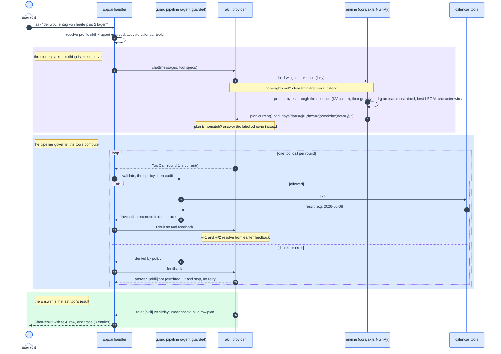
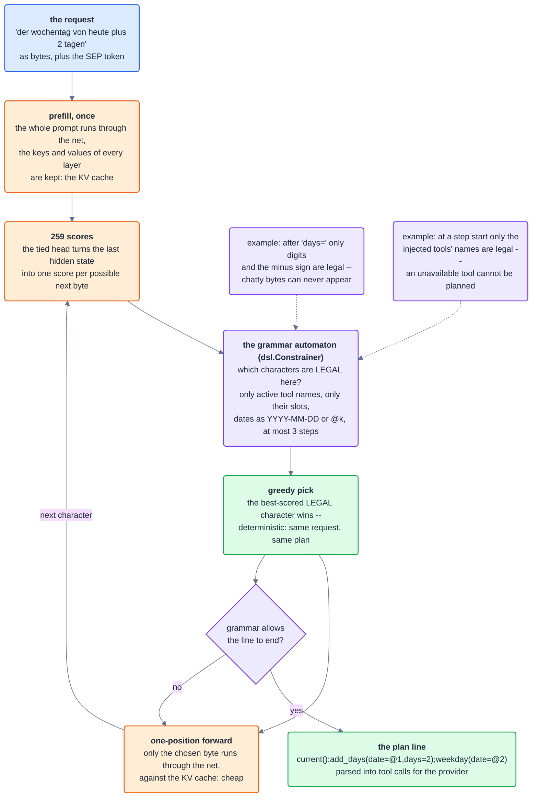
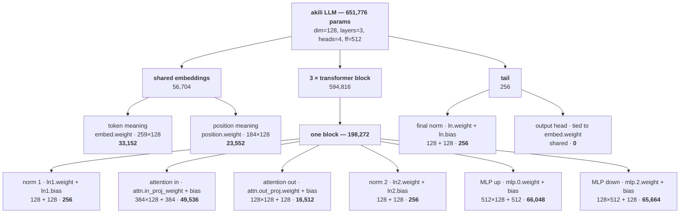
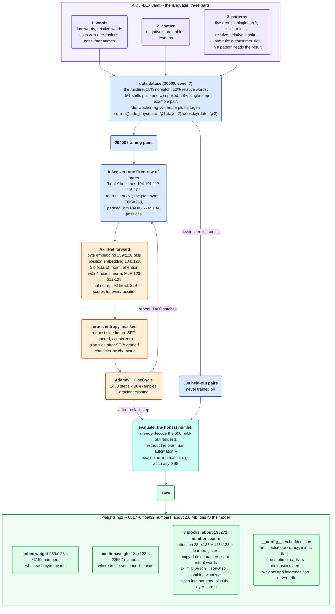

<!--
Copyright (c) 2026 Tom (Thomas) Freudenberg th.freudenberg@gmail.com

This file is part of the Tokeo-Fundi project.

The akili module is primarily a training and demonstration tool,
intended for experimentation and the gathering of insights.
It serves as foundational material within this context.

IMPORTANT: While the surrounding repository may be licensed under the
MIT License, this specific file is governed exclusively by the
Tokeo-Fundi Source-Available License 1.0.

Use, modification, and distribution are permitted strictly in
accordance with the terms of this license, which includes specific
revenue and headcount thresholds for zero-cost qualification.

A copy of the full license is available at:
https://github.com/tokeo/fundi/blob/master/LICENSE.md

If your entity does not qualify for the zero-cost license, a separate
commercial Enterprise License is required.
-->

# akili -- the project's own micro language model

```akili``` is a real, trained language model that belongs to this application:
a few hundred thousand parameters learned from scratch on the project's own
synthetic data, running in-process with plain NumPy -- no host to start, no
network, no third-party weights. It does one thing, and does it exactly: it
turns a natural-language request (English or German) into a **plan** of tool
calls over the project's calendar toolset, including nested requests like
*"the weekday of today plus 2 days"*, which become real three-step chains.

It complements the framework's built-in ```mock``` provider: ```mock``` is the
neutral, deliberately dumb test double that proves the machinery (loop,
guards, budgets, trace) without any prerequisite; ```akili``` is the content --
the proof that a generated project can own, train, and operate its model.
The agents stay model-free compositions: the same ```audited``` or ```guarded```
agent runs against ```mock```, ```akili```, or a remote profile unchanged.

Train-first: the weights are a project asset created by you. Run

    python -m {{ app_label }}.core.akili.train

once; it reports the held-out accuracy and writes ```weights.npz``` into this
package. Until then the ```akili``` profile raises a clear hint and the akili
test cases skip.

## What you can ask it

Its competence is exactly the trained domain: the calendar tools, in
English and German, in plain and nested wordings, with time words and
signed offsets. Small, but real tasks:

    # appointments and weekdays
    {{ app_label }} ai ask "der wochentag von heute" --profile akili
    {{ app_label }} ai ask "weekday of 2026-12-24" --profile akili

    # deadlines and countdowns
    {{ app_label }} ai ask "count the days from today until 2026-12-24" --profile akili
    {{ app_label }} ai ask "add 90 days to 2026-06-08" --profile akili
    {{ app_label }} ai ask "das datum 14 tage vor 2026-12-24" --profile akili

    # planning
    {{ app_label }} ai ask "die kalenderwoche von heute plus 30 tagen" --profile akili
    {{ app_label }} ai ask "die mondphase am 2000-01-06" --profile akili

    # relative words, chains of them, and month/year shifts
    {{ app_label }} ai ask "welches datum ist übermorgen" --profile akili
    {{ app_label }} ai ask "the week number of next month" --profile akili
    {{ app_label }} ai ask "the date of tomorrow next year" --profile akili
    {{ app_label }} ai ask "heute plus 1 jahr" --profile akili

    # the current date itself: a bare time word is enough
    {{ app_label }} ai ask "today" --profile akili
    {{ app_label }} ai ask "heute" --profile akili

    # weeks are seven-day shifts (no add_weeks tool)
    {{ app_label }} ai ask "today minus 1 week" --profile akili
    {{ app_label }} ai ask "2026-06-08 plus 3 weeks" --profile akili

    # days between today and a date relative to today
    {{ app_label }} ai ask "count the days from today until tomorrow" --profile akili
    {{ app_label }} ai ask "tage von heute bis naechste woche" --profile akili

    # and the three-step chains, its signature move
    {{ app_label }} ai ask "the weekday of today plus 14 days" --profile akili
    {{ app_label }} ai ask "der wochentag von vor 2 tagen" --profile akili

Deadline calculators, release countdowns, week-number lookups, "x days of
lead time before date y" -- deterministic, offline, tens of milliseconds,
and fully audited under ```--agent guarded```.

### A planner, not a texter

The model's only learned output language is the plan DSL (plus
```<nomatch>```). The answer you see (```[akili] weekday: Tuesday```) is always
the result of the last tool in the chain: the facts come from the
computation, never from the model. That split is deliberate -- dates and
arithmetic are exactly what language models, small or large, get wrong
when they memorize, and exactly what tools compute precisely. A 380k
model could never store a million date facts, but it can learn perfectly
*which computation is meant*. This is also why akili cannot hallucinate
*form*: the plan grammar admits no invented tools or syntax, and what the
model does not understand becomes an honest ```<nomatch>```. It can still
hallucinate *meaning* -- a well-formed plan for a question that was never
asked -- typically where a request falls into the gap between the trained
patterns and the trained refusals. ```AKILI-USE.md``` (act 3) demonstrates
these limits on purpose, and why the fundi machinery around the model is
there to catch them.

So there are three kinds of answers: a **tool result** (the normal
case), **honest ignorance** (```[akili] sing me a song``` -- the labelled
echo marks "outside my domain"), and **explanations** when the guard
pipeline reports ```denied:``` or ```error:``` ("not permitted: ..." instead of
retrying). Free-form text is not this model's job: where wording matters,
the clean place is a remote profile behind the very same agents, guards,
and tools -- the ladder mock -> akili -> remote model tells the full
story. To give akili new *tasks*, give it new tools and teach them (see
below); the provider, guards, and agents stay untouched.

### Honest limits, by design

A literal sign inside a request is not part of the language. Direction is
carried by words -- minus, before, ago (vor, abziehen in German) -- the
count is always written bare, and the sign lives in the plan. A sign
written onto the count itself is taught as ```<nomatch>``` in every
phrasing -- bare ("today plus -2 days", "add +5 months") and
consumer-wrapped ("the weekday of today plus -2 days") alike. The model
answers with the honest labelled echo instead of inventing a digit or
quietly dropping the shift, so the rule is enforced by the model, not
only described here. Use the worded backward forms instead.

Honesty is also taught close to the domain, not only far away: the
negatives include calendar-near requests the model cannot serve ("the
date of christmas", "wann ist ostern"), so unsupported wordings answer
with the labelled echo instead of an invented plan. A small set of short
greetings and pleasantries ("hello", "hallo", "how are you", "danke
schoen") is in the negatives too, kept free of calendar-ambiguous words,
so a bare greeting echoes honestly rather than being answered with a
date. And a small share of
the training requests carries one human typo -- a doubled letter or
swapped neighbours -- so common slips like "tommorrow" usually still
find their plan, while dates and digits are never touched: exact copying
stays exact.

## From ask to answer, as a picture

How one question travels through the whole stack -- the handler, the
agent's guard pipeline, the provider, the NumPy engine, and the tools.
Follow the numbers; the example is the signature three-step chain:



Color key: blue boxes are the framework actors, the violet band is the
planning phase, the blue band the governed execution loop, the green
band the answer; yellow notes mark the designed failure paths.

Three things to take away from the picture. First, the model never
executes anything: it only ever emits the next tool call, and every
execution runs through the agent's guards -- the model plans, the
pipeline governs, the tools compute. Second, the engine appears exactly
once per round and is pure NumPy: load the weights lazily, run the
prompt through the net, then pick, character by character, the best
*legal* continuation -- which is why a malformed plan is impossible.
Third, every failure mode has a designed answer: missing weights raise
the train-first hint, an out-of-domain request becomes the honest
labelled echo, and a denial ends the run with an explanation instead of
a retry loop.

### Inside the engine: how the weights answer

Step 6 of the sequence above, zoomed in. This is everything that happens
when the trained model is *used* -- pure NumPy over the matrices from
```weights.npz```, one character at a time, with the grammar as a fence:



Color key: blue is the input, orange the model's matrices at work,
violet the grammar fence, green the decisions and the result.

Why this loop is fast and safe at once: the expensive part (the whole
prompt through the net) happens exactly once; every generated character
afterwards is a single-position forward against the cache -- tens of
milliseconds for a full plan. And the model's freedom is exactly the
grammar's freedom: it chooses *which* legal continuation, never
*whether* to be legal. The weights supply the judgement, the automaton
supplies the fence, and greedy picking makes the whole thing
reproducible -- the three properties (smart, safe, deterministic) come
from three separate, inspectable parts.

## The pieces in this package

### ```dsl.py``` -- the plan language and its gatekeeper

The tiny target language the model speaks: one line, steps joined by ```;```,
for example

    current();add_days(date=@1,days=2);weekday(date=@2)

where ```@k``` means "the result of step k", and ```<nomatch>``` marks a request
outside the domain. The module holds ```DOMAIN``` (which tool has which slots,
the single place that knows the toolset), ```render```/```parse``` (plan to line and
back), and the ```Constrainer```: a byte-level automaton that answers, for any
partial line, which characters are legal next -- only active tool names,
only their slots, dates only as ```YYYY-MM-DD``` or ```@k```, at most three steps.
The decoder may only pick what the automaton allows, so the model can never
emit a malformed plan or a tool outside the injection, no matter how it was
trained.

### ```tokenizer.py``` -- the byte vocabulary

No trained vocabulary: the 256 byte values plus ```PAD```, ```SEP```, and ```EOS```
(vocabulary size 259). Byte level is the decisive choice here -- dates and
numbers consist of the same characters as the sentence, so the model can
copy them character by character instead of treating them as unknown words.
That property is what keeps a model this small exact.

### ```data.py``` -- the synthetic data generator

The calendar domain is closed, so the dataset is generated, not collected.
Every example is a *(sentence, plan line)* pair, built from phrase templates
per tool in English and German, nested compositions, time words
(today/now/current and heute/jetzt/aktuell) that put a ```current()``` step in
front of the plan, distractor preambles and polite lead-ins (also in front
of negatives, so chatter never becomes a positive signal by itself), and
out-of-domain negatives that map to ```<nomatch>``` -- the anti-hallucination
training. Day offsets are signed: plus/after/in wordings map to positive
day values, minus/before/ago (minus/vor in German) to negative ones.
Relative words (tomorrow, übermorgen, last week, next year ...) live in a
lookup table -- one line per word, mapping it to its shift from today --
they chain ("tomorrow next year" is two shifts in order), and every
shift shape speaks all units alike -- the unit word (days, months,
years) picks the tool.
Teaching a new word is adding a table line and retraining. A fixed seed
makes the dataset reproducible at any time; run
```python -m {{ app_label }}.core.akili.data``` to print samples.

**The mixture and its thin seams.** The mixture is deliberately weighted
(the commented cut points in ```sample```), and the weighting carries a
lesson: an aggregate accuracy is an average over the mixture, so a class
that is thin in the data is nearly invisible in the number -- a model can
score above the quality bar and still fail a thin class often. The
thinnest seam here is the composed minus shift from an explicit date
("the weekday of 2026-12-24 minus 2 days"): the sign, the explicit date
and the trailing consumer each cut its share down. Two levers keep that
seam honest without a single extra training step: ```_render_shift```
re-rolls half of the minus shifts onto a composed pattern (the bucket
shares stay untouched, only the inside of the minus slice drills the
chain harder), and ```evaluate``` prints the accuracy per request class
beside the aggregate -- the honest look behind the single number. More
steps only polish the distribution; the distribution decides what there
is to polish.

### ```AKILI-LEX.yaml``` -- the editable language definition

The complete language of the training data as a richly commented yaml
file in three parts: **words** (time words, relative words with their
shift from today, the units with their declensions -- and a week is just
an ```add_days``` unit with a factor of 7, since a week shift is a seven-day
shift and there is no ```add_weeks``` tool -- consumer names), **chatter**
(negatives, preambles, lead-ins), and **patterns** -- five
groups (```single```, ```shift```, ```shift_minus```, ```relative```, ```relative_chain```),
held together by one rule: *a ```{c}``` in any pattern means a consumer reads the
result*. ```data.py``` loads and validates it at import time (unknown tools
and missing placeholders fail loudly), a weight-free test guards the
format, and pdoc renders the whole file syntax-highlighted into the data
module's page. One file to read what the model is taught -- and to
extend it.

### ```train.py``` -- the training tool (the only torch in the project)

A from-scratch decoder-only transformer: byte embeddings plus position
embeddings, three blocks of multi-head attention and a small MLP, projected
back against the embedding matrix (tied head) -- about 380k parameters. The
training sequence is ```sentence + SEP + plan + EOS```, and the loss only counts
the plan side. AdamW with a one-cycle schedule, environment knobs
(```AKILI_STEPS```, ```AKILI_BATCH```, ```AKILI_DATA```), and interruptible chunked runs
via ```AKILI_CKPT```/```AKILI_CHUNK```. At the end it evaluates exact-plan accuracy
on held-out examples and saves ```weights.npz```. Torch is a dev-side tool only;
the application never imports it.

The ```--no-minus``` switch is a built-in ablation experiment:

    python -m {{ app_label }}.core.akili.train             # with minus teaching
    python -m {{ app_label }}.core.akili.train --no-minus  # without

Both runs share the architecture, the budget, and the schedule -- only the
dataset differs: with the switch, every signed-offset wording is left out,
and the resulting model has no notion of minus days (a request like
*"today minus 2 days"* falls back to the nearest learned pattern). Training
two weights files this way makes the central lesson of the lab tangible:
capability lives in the data, not in the code. The choice is recorded in
the exported metadata (```minus: true/false```), so a weights file always tells
what it was taught; the sample printer takes the same switch
(```python -m {{ app_label }}.core.akili.data --no-minus```).

### ```infer.py``` -- the runtime (plain NumPy)

Loads ```weights.npz``` and reruns the exact forward pass in NumPy (verified
bit-compatible with torch). Decoding is greedy and constrained: from the
model's ranking, the best *legal* character wins. A KV cache makes it fast
(the sentence is processed once, every generated character is a single-step
forward, in the order of tens of milliseconds per request), and if
[numba](https://numba.pydata.org) is installed, the attention loop is
JIT-compiled automatically -- without it the same numbers run as pure NumPy.

### ```weights.npz``` -- the model itself

A compressed archive of named float32 matrices, one per parameter, plus the
architecture and the achieved accuracy as embedded metadata, so inference
and weights can never drift apart. Created exclusively by training.

#### Anatomy of the weights -- every number accounted for

The default architecture (```dim=128```, ```layers=3```, ```heads=4```, ```ff=512```,
```context=184```, ```vocab=259```) produces exactly **651,776** trainable numbers.
Here is where each one lives:

Every number sits in one of a few jobs. The **embeddings** turn input into
meaning: ```embed.weight``` holds one 128-number vector per possible byte (the
model's whole vocabulary), and ```position.weight``` holds one per slot in the
context window, so the model knows both *what* each token is and *where* it
sits. The three **transformer blocks** are where thinking happens, and each
block does the same two moves: **attention** lets every token look at the other
tokens and pull in what is relevant, then the **MLP** processes what each token
gathered. The two **layer norms** per block keep the numbers in a stable range
so the stack can be trained deep. The **tail** is a final norm plus the output
step that turns the last vectors back into a score for every possible next
byte.

The total splits into shared embeddings, three identical transformer blocks
(the bulk), and a tiny tail. Each block is the sum of six parts:



The same numbers, laid out as a table -- every matrix, its shape, and the count
it contributes (the numbers column is right-aligned so the magnitudes line up):

| part                     | matrix                        |      shape      |     numbers |
|--------------------------|-------------------------------|:---------------:|------------:|
| token meaning            | embed.weight                  |    259 x 128    |      33,152 |
| position meaning         | position.weight               |    184 x 128    |      23,552 |
| per block: norm 1        | ln1.weight + ln1.bias         |    128 + 128    |         256 |
| per block: attention in  | attn.in_proj_weight + bias    | 384 x 128 + 384 |      49,536 |
| per block: attention out | attn.out_proj.weight + bias   | 128 x 128 + 128 |      16,512 |
| per block: norm 2        | ln2.weight + ln2.bias         |    128 + 128    |         256 |
| per block: MLP up        | mlp.0.weight + bias           | 512 x 128 + 512 |      66,048 |
| per block: MLP down      | mlp.2.weight + bias           | 128 x 512 + 128 |      65,664 |
| **one block**            | _sum of the six rows above_   |                 | **198,272** |
| three blocks             | _3 x one block_               |                 |     594,816 |
| final norm               | ln.weight + ln.bias           |    128 + 128    |         256 |
| output head              | _tied to_ embed.weight        |    (shared)     |           0 |
| **total**                |                               |                 | **651,776** |

How a shape becomes a count: a weight matrix that maps an *in*-sized vector to
an *out*-sized one is an ```out x in``` grid of numbers, plus one bias per
output. So ```mlp.0.weight``` (the MLP-up step) widens 128 to 512 -- that is
512 x 128 = 65,536 weights plus 512 biases = 66,048 -- and ```mlp.2.weight```
narrows it back, 128 x 512 + 128 = 65,664. The norms are cheap because they only
scale and shift each of the 128 features: one weight and one bias each, 256 in
total. Read the table top to bottom and you are reading the forward pass: look
up meaning and position, then three times over attend-and-process, then project
back to byte scores. The **output head adds zero parameters**: it
reuses the embedding matrix transposed (```embed.weight.T```), so the same
33,152 numbers both map a byte to a vector and map a vector back to byte
scores. And the **attention projection is the per-block heavyweight**
(49,536 + 16,512): ```in_proj``` is three stacked 128 x 128 maps (query, key,
value) plus bias, which is why widening ```dim``` grows the model roughly with
its square. The whole file is float32, so 651,776 numbers are about 2.6 MB
on disk -- small enough to read, ship, and reason about completely.

One save-side footnote: because the head is tied, the exported ```state_dict```
lists ```head.weight``` as a second name for the same matrix, so the npz
physically stores that 33,152-number table twice. The runtime only ever
reads ```embed.weight```; the duplicate is harmless and never counted as a
parameter (```model.parameters()``` reports the 651,776 unique numbers).

#### What the pipeline checks

The lab fails loud rather than wrong. Every guard, and what it catches:

- **lexicon validation** (```data._load_lexicon```, at import): an unknown
    tool or a pattern missing a required placeholder raises immediately --
    a typo in ```AKILI-LEX.yaml``` can never train silently.
- **grammar legality** (```dsl.Constrainer```): a generated plan can only be
    legal DSL over the active tools; a malformed plan is impossible to emit.
- **the decoder budget guard** (a weight-free test): the longest plan the
    data can produce must fit ```PLAN_BUDGET```, with room for EOS -- so a new,
    longer pattern group surfaces in the tests instead of being truncated.
- **byte-exact held-out evaluation** (```train.evaluate```): accuracy counts
    only whole plan lines that match character for character, decoded
    without the grammar fence -- an honest lower bound on the raw model.
- **the ablation invariant** (```--no-minus```): no example carries a backward
    wording, and no plan a negative value -- one variable changes, nothing
    else, so the two models differ only in what the data taught.

## Training, in plain words

Training asks the network the same kind of question millions of times:
*here is the sentence, the separator, and the beginning of the plan line --
which character comes next?* The network guesses, the truth is in the
dataset, and the gap between guess and truth is measured as a loss. Then
backpropagation computes, for every one of the ~380k numbers, in which
direction a tiny turn would shrink that loss -- and turns them all a little.
Repeat with fresh batches, first with large steps, then fine ones. That is
all training is: organized trial and error with feedback, until the right
continuations are the most probable ones.

### The pipeline as a picture

The same story as a diagram, with real numbers from a default run. Read
it top to bottom: language in, weights out -- and the box at the bottom
shows what the weights file actually contains:



Color key: violet is the language source, blue the data side, orange the
learning loop, teal the honest measurement, green the shipped artifact.

How to read the loop in the middle: one step takes 96 fresh examples,
asks the net for its next-character guesses, measures the gap on the
plan side only, and turns all 651776 numbers a tiny bit -- 1400 times,
first with large turns, then fine ones (the OneCycle schedule). The
held-out 600 never enter that loop, which is what makes the final
accuracy an honest number. And the weights box is the whole model: no
code, no rules ship with it -- the named matrices plus the embedded
architecture are everything ```infer.py``` needs, which is why inference
can be plain NumPy and why weights and runtime can never drift apart.

What ends up in the weights is **no rule, no word list, no if-then** -- only
matrices that together form a function. Roles can be ascribed: the
embeddings place every byte in a 96-dimensional space; attention matrices
are learned gazes (when writing a date slot, look back at the date
characters in the sentence -- which is why copies are exact; other heads
attend to intent words like *weekday* or *wochentag*); the MLPs combine what
was seen into patterns (*time word present, so the plan starts with*
```current()```). The knowledge lives distributed across all of them; no single
number means anything, only their interplay does. That is why it shows real
(small) language-model behavior -- it generalizes over phrasings never seen
verbatim -- and why its competence honestly ends where the data generator's
teaching ends. Determinism holds throughout: fixed weights, greedy decoding,
and the grammar automaton -- same sentence, same plan, every time.

## Extending the model

The path is always the same: teach it in ```data.py``` (new templates, new
tools in ```DOMAIN```, more phrasings, more languages), retrain with
```python -m {{ app_label }}.core.akili.train```, and check the reported accuracy
plus the project's test suite. The provider (```core/ai/providers/akili.py```), the
guards, and the agents need no change -- the plan grammar adapts to the
active tools at runtime.
